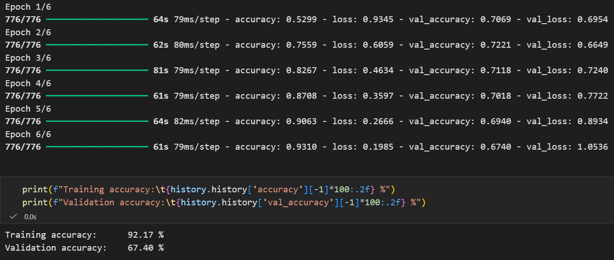

# LSTMood

**LSTMood** is a deep learning-based sentiment analysis and mood detection project. It uses Long Short-Term Memory (LSTM) networks to capture the sentiment of the text.

## Tech Stack


## Dataset
https://www.kaggle.com/datasets/abhi8923shriv/sentiment-analysis-dataset

## Model Architecture
```python
model = Sequential([
    Vectorizer,
    Embedding(max_tokens, 256),
    LSTM(128),
    Dense(3, activation='softmax')
])

model.compile(
    optimizer='adam',
    loss='sparse_categorical_crossentropy',
    metrics=['accuracy']
)
```

## Accuracy



## Author
[](https://kaggle.com/krishnatherokar/)